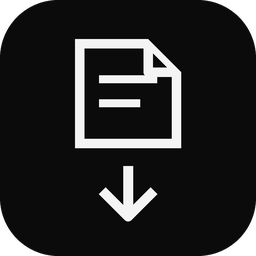
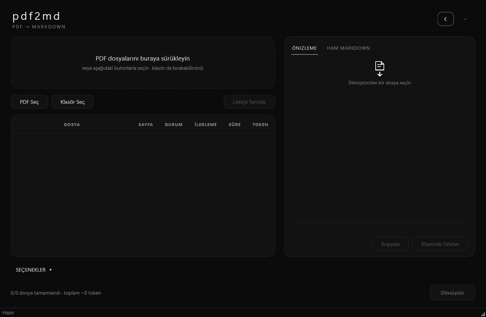
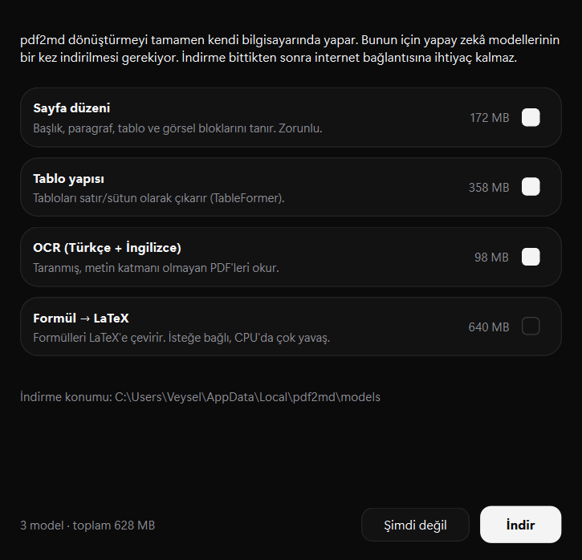
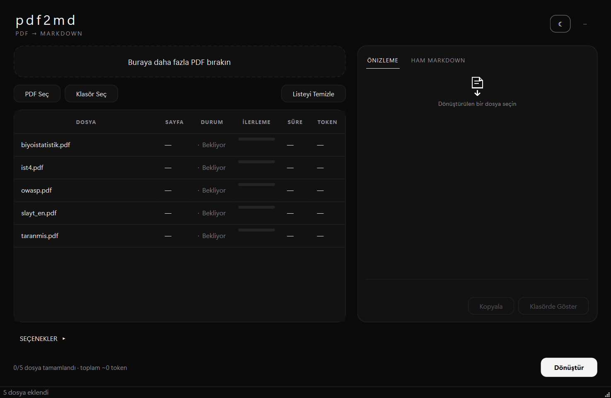
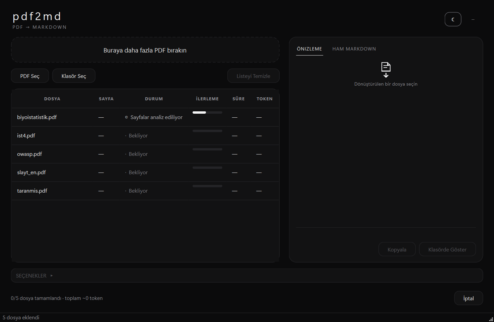
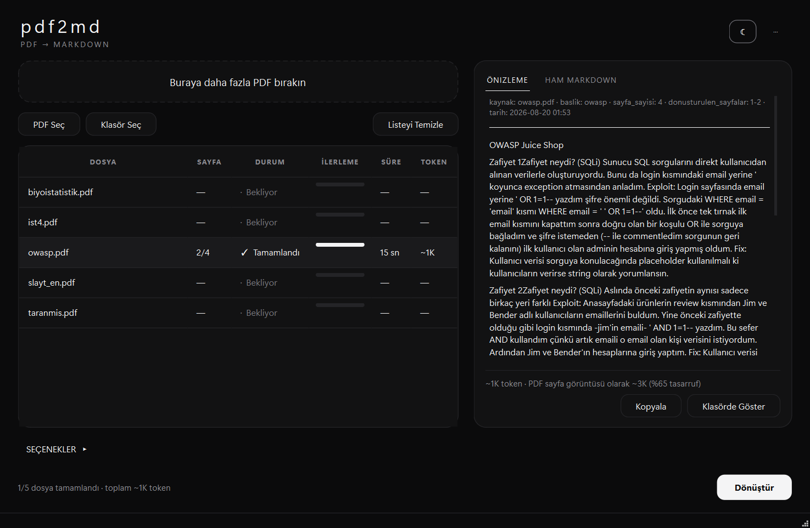
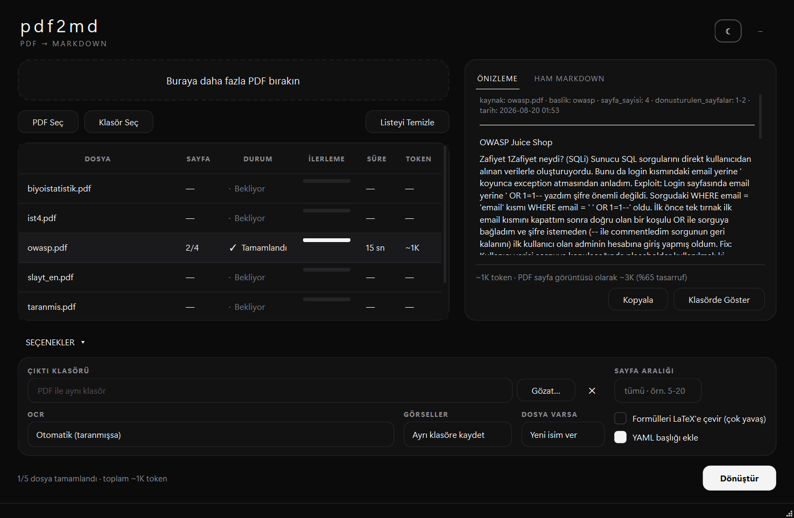
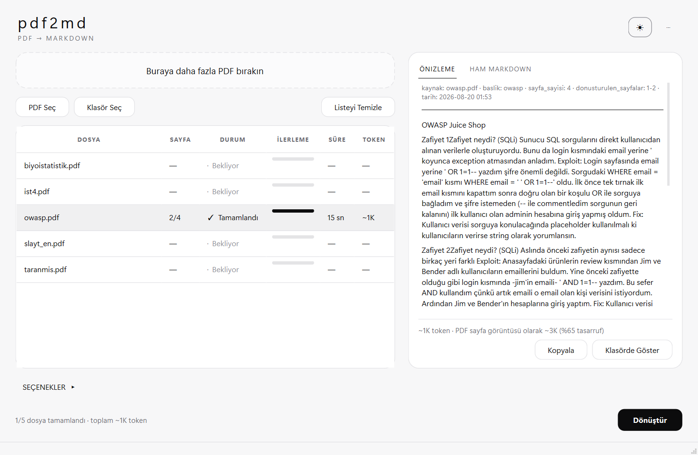

# pdf2md

**PDF dosyalarını yapay zekâya verilmeye uygun Markdown metnine çeviren Windows uygulaması.**
Kurulum gerektirmez, çalışırken internete ihtiyaç duymaz, dosyaların bilgisayarından çıkmaz.



---

## Bilgisayarıma nasıl kurarım?

**Windows 10/11 (64 bit) gerekir. Python, kurulum sihirbazı veya yönetici şifresi gerekmez.**

### 1. İndir

[**⬇ pdf2md-0.1.0-windows.exe**](https://github.com/veys1406/pdf2md/releases/latest) —
273 MB. (Bu sayfanın sağındaki **Releases** bölümünden de ulaşabilirsin.)

### 2. Aç

İndirdiğin dosyaya **çift tıkla**. Kendi kendine açılan bir arşivdir: nereye açılacağını
sorar, örneğin `C:\Programlar` yaz ve **Extract**'e bas. Yaklaşık 1 GB dosya açılır.

Windows *"Bilgisayarınız korundu"* uyarısı verirse → **Ek bilgi** → **Yine de çalıştır**.
(Uygulama imzasız olduğu için çıkar, zararlı olduğu anlamına gelmez.)

### 3. Çalıştır

Oluşan `pdf2md` klasöründeki **`pdf2md.exe`** dosyasına çift tıkla. İlk açılışta gelen
pencerede **İndir**'e bas: yapay zekâ modelleri bir kez iner (628 MB, 5–20 dakika).
Bundan sonra program internetsiz de çalışır.

### 4. Kullan

PDF'lerini pencereye sürükleyip **Dönüştür**'e bas. Her PDF'in yanında aynı isimde bir
`.md` dosyası oluşur.

> Silmek istersen: açtığın `pdf2md` klasörünü ve `%LOCALAPPDATA%\pdf2md` klasörünü sil.
> Kayıt defterine veya sistem klasörlerine hiçbir şey yazılmaz.

Her adımın ekran görüntülü ayrıntısı aşağıda. Kaynak koddan çalıştırmak istersen
[Geliştiriciler için](#geliştiriciler-için) bölümüne bak.

---

## İçindekiler

- [Bilgisayarıma nasıl kurarım?](#bilgisayarıma-nasıl-kurarım) ← **buradan başla**
- [Bu program ne işe yarar?](#bu-program-ne-işe-yarar)
- [1. Adım: İndirme](#1-adım-indirme)
- [2. Adım: Açma](#2-adım-açma)
- [3. Adım: İlk açılış ve modeller](#3-adım-ilk-açılış-ve-modeller)
- [4. Adım: İlk PDF'ini çevir](#4-adım-ilk-pdfini-çevir)
- [5. Adım: Çıktıyı bulma ve kullanma](#5-adım-çıktıyı-bulma-ve-kullanma)
- [Ayarlar](#ayarlar)
- [Görünüm](#görünüm)
- [Klavye kısayolları](#klavye-kısayolları)
- [Sık sorulan sorular](#sık-sorulan-sorular)
- [Geliştiriciler için](#geliştiriciler-için)

---

## Bu program ne işe yarar?

Bir PDF'i ChatGPT, Claude veya Gemini gibi bir yapay zekâya verdiğinde program onu
**sayfa fotoğrafı** gibi okur. Bu hem pahalıdır (her sayfa yaklaşık 1500 "token" harcar)
hem de tablolar ile başlıklar sıklıkla karışır.

pdf2md aynı belgeyi **Markdown** denen düz metin biçimine çevirir. Markdown'da başlıklar,
listeler ve tablolar korunur ama gereksiz her şey atılır. Sonuç:

- Aynı belge çoğu zaman **yarı yarıya daha az token** harcar — yani daha ucuz ve daha uzun
  sohbetlere sığar.
- Yapay zekâ tabloyu tablo, başlığı başlık olarak görür; daha isabetli cevap verir.
- Taranmış (yazısı fotoğraf hâlinde olan) belgeler bile okunur — program metni kendisi
  tanır.

Program ne yaptığını her dosya için sana gösterir: kaç token tuttuğunu ve PDF'i olduğu gibi
verseydin kaç token tutacağını yan yana yazar.

---

## 1. Adım: İndirme

1. Bu sayfanın sağ tarafındaki **Releases** bölümüne tıkla
   (veya doğrudan: [Releases sayfası](https://github.com/veys1406/pdf2md/releases)).
2. En üstteki sürümün altındaki **`pdf2md-0.1.0-windows.exe`** dosyasına tıklayıp indir.
   Dosya yaklaşık **273 MB**'tır, indirmesi birkaç dakika sürebilir.

> **Not:** Tarayıcın "bu dosya yaygın olarak indirilmiyor" gibi bir uyarı verebilir.
> Dosya imzalı olmadığı için normaldir; **Sakla / Yine de indir** de.

---

## 2. Adım: Açma

Bu dosya bir **kendi kendine açılan arşiv**dir. Yani klasik bir kurulum yapmaz:
kayıt defterine yazmaz, sistem klasörlerine dokunmaz, yönetici şifresi istemez.

1. İndirdiğin `pdf2md-0.1.0-windows.exe` dosyasına **çift tıkla**.
2. Karşına dosyaların nereye açılacağını soran bir pencere gelir. Örneğin
   `C:\Programlar` ya da `Belgelerim` içinde bir klasör seçebilirsin. **Extract**'e bas.
3. Açılma birkaç dakika sürer (yaklaşık 1 GB dosya açılır).
4. Seçtiğin yerde **`pdf2md`** adlı bir klasör oluşur. İçindeki **`pdf2md.exe`**
   dosyasına çift tıklayarak programı başlat.

> **Windows "Bilgisayarınız korundu" uyarısı verirse:** *Ek bilgi* → *Yine de çalıştır*.
> Bu uyarı, programın parayla alınan bir imzası olmadığı için çıkar; zararlı olduğu
> anlamına gelmez.

**İpucu:** `pdf2md.exe` dosyasına sağ tıklayıp *Başlat menüsüne sabitle* diyebilir veya
masaüstüne kısayol oluşturabilirsin.

Programı silmek istersen: açtığın `pdf2md` klasörünü ve `%LOCALAPPDATA%\pdf2md`
klasörünü sil. Başka hiçbir yere dosya bırakmaz.

---

## 3. Adım: İlk açılış ve modeller

Program **ilk kez açıldığında** karşına şu pencere gelir:



pdf2md, PDF'leri çevirirken yapay zekâ modelleri kullanır ve bunlar senin bilgisayarında
çalışır. Bu modellerin **bir kez** indirilmesi gerekir.

- **İndir**'e bas ve bekle. Toplam **628 MB** iner; internet hızına göre 5–20 dakika sürer.
- İndirme bittikten sonra programın internete bir daha ihtiyacı olmaz.
- İndirme sırasında **İptal** edebilirsin; yarım inen dosyalar korunur, sonra kaldığı
  yerden devam eder.

| Model | Boyut | Ne işe yarar |
|---|---|---|
| Sayfa düzeni | 172 MB | Başlıkları, paragrafları, tabloları ve görselleri tanır |
| Tablo yapısı | 358 MB | Tabloları satır ve sütun olarak çıkarır |
| OCR (Türkçe + İngilizce) | 98 MB | Taranmış, yazısı fotoğraf olan PDF'leri okur |
| Formül → LaTeX | 640 MB | *İsteğe bağlı.* Matematik formüllerini çevirir (çok yavaş) |

İlk üçü zorunludur ve otomatik seçilidir. Dördüncüsü isteğe bağlıdır; **normal bir
bilgisayarda çok yavaş çalıştığı için varsayılan olarak kapalıdır**, ihtiyacın yoksa indirme.

Modeller `%LOCALAPPDATA%\pdf2md\models` klasörüne iner. Durumlarını istediğin zaman
sağ üstteki **⋯** düğmesinden **Modeller…** ile görebilirsin.

---

## 4. Adım: İlk PDF'ini çevir

### Dosyaları ekle

PDF dosyalarını **fare ile sürükleyip** pencerenin üst kısmındaki kesikli çerçeveye
bırak. İstersen **PDF Seç** düğmesiyle de seçebilirsin. Bir **klasörü** bırakırsan
içindeki tüm PDF'ler listeye eklenir.



### Dönüştür

Sağ alttaki **Dönüştür** düğmesine bas. Dosyalar sırayla işlenir; her satırda ne
yapıldığını ve ilerlemeyi görürsün.



- Normal bir PDF sayfası birkaç saniye sürer.
- Taranmış belgelerde metin tanıma devreye girer; bu **sayfa başına 10–20 saniye** olabilir.
- **İptal** düğmesi işlemi durdurur (o an işlenen dosya bitince durur).

Durum sütunundaki işaretler:

| İşaret | Anlamı |
|---|---|
| `·` Bekliyor | Sırasını bekliyor |
| `◍` | Şu anda işleniyor |
| `✓` Tamamlandı | Markdown dosyası oluştu |
| `✕` Hata | Dosya açılamadı (bozuk, şifreli vb.) — üzerine gelince nedeni yazar |
| `○` İptal edildi | Sen durdurdun |

### Sonucu gör

Bir dosya bittiğinde sağ taraftaki panelde önizlemesi açılır. Alt satırda kaç token
tuttuğu ve **ne kadar tasarruf ettiğin** yazar.



- **Önizleme** sekmesi sonucu okunabilir biçimde gösterir.
- **Ham Markdown** sekmesi yapay zekâya yapıştıracağın metnin aynısını gösterir.
- **Kopyala** düğmesi bu metnin tamamını panoya alır — doğrudan sohbete yapıştırabilirsin.

---

## 5. Adım: Çıktıyı bulma ve kullanma

Program her PDF için yanına aynı isimde bir **`.md`** dosyası oluşturur:

```
Belgelerim\
  rapor.pdf            ← senin dosyan
  rapor.md             ← oluşan Markdown
  rapor_images\        ← belgedeki şekiller (varsa)
```

- **Klasörde Göster** düğmesi bu dosyayı Windows Gezgini'nde açar.
- Listedeki bir satıra **sağ tıklayarak** *Markdown'ı aç* veya *Klasörde göster*
  diyebilirsin.
- `.md` dosyasını Not Defteri ile açabilirsin; içi düz metindir.

**Yapay zekâya nasıl veririm?** İki yol var: `.md` dosyasını sohbete dosya olarak
yükleyebilir ya da **Kopyala** ile metni alıp doğrudan yapıştırabilirsin.

---

## Ayarlar

Sol alttaki **SEÇENEKLER** yazısına tıklayınca ayarlar açılır. Hiçbirine dokunmadan da
kullanabilirsin; varsayılanlar çoğu belge için uygundur.



| Ayar | Varsayılan | Ne yapar |
|---|---|---|
| **Çıktı klasörü** | PDF ile aynı yer | Tüm çıktıları tek bir klasörde toplamak istersen değiştir |
| **Sayfa aralığı** | tümü | Sadece bir bölümü çevirmek için `5-20` gibi yaz |
| **OCR** | Otomatik | Taranmış belge algılanırsa metni tanır. *Her zaman* seçeneği çok yavaştır |
| **Görseller** | Ayrı klasöre kaydet | Şekilleri `_images` klasörüne çıkarır. *Atla* dersen hiç kaydetmez |
| **Dosya varsa** | Yeni isim ver | Aynı isimde `.md` varsa `rapor-1.md` yapar |
| **Formülleri LaTeX'e çevir** | Kapalı | Matematik formülleri için. **Çok yavaştır**, küçük sayfa aralığıyla dene |
| **YAML başlığı ekle** | Açık | Dosyanın başına kaynak, sayfa sayısı ve tarih bilgisi koyar |

Ayarları değiştirdiğinde hatırlanır; programı kapatıp açtığında aynı kalır.

---

## Görünüm

Sağ üstteki ay/güneş düğmesi koyu ve açık tema arasında geçiş yapar.



---

## Klavye kısayolları

| Kısayol | İşlev |
|---|---|
| `Ctrl + O` | PDF seç |
| `Ctrl + Shift + O` | Klasör seç |
| `Ctrl + Enter` | Dönüştür |
| `Esc` | Dönüştürmeyi iptal et |
| `Ctrl + L` | Listeyi temizle |
| `Ctrl + M` | Modeller penceresi |
| `F1` | Hakkında |

---

## Sık sorulan sorular

**Dosyalarım bir yere gönderiliyor mu?**
Hayır. Bütün çevirme işlemi senin bilgisayarında yapılır. Program internete yalnızca ilk
açılışta modelleri indirmek için bağlanır; ondan sonra çevrimdışı da çalışır.

**Neden bu kadar büyük (1 GB)?**
İçinde yapay zekâ kütüphaneleri ve çalışma ortamı var. Böylece bilgisayarına Python veya
başka bir şey kurman gerekmiyor.

**Program bir süre yanıt vermiyor gibi görünüyor.**
İlk dönüştürmede modeller belleğe yükleniyor; bu 10–30 saniye sürebilir. Sonraki dosyalar
çok daha hızlı işlenir.

**Taranmış belgem yanlış okundu.**
Metin tanıma mükemmel değildir; el yazısı, düşük çözünürlüklü veya eğri taranmış sayfalarda
hata yapar. Belge düz ve net taranmışsa sonuç belirgin şekilde daha iyi olur.

**Tabloların bazıları bozuk çıkıyor.**
Çok sütunlu, iç içe geçmiş veya çizgisiz tablolar zorlu durumlardır. Çıktıyı Not Defteri
ile açıp elle düzeltebilirsin.

**"Hata" yazan dosyalar ne oldu?**
Dosya bozuk, şifre korumalı veya PDF olmayabilir. Satırın üzerine gelince sebebi yazar.
Sorun sürerse **⋯** menüsünden *Günlük klasörünü aç* diyerek ayrıntılı kaydı görebilirsin.

**Sonuçtaki token sayısı ne kadar doğru?**
Yaklaşıktır (bu yüzden başında `~` işareti var). Farklı yapay zekâlar biraz farklı sayar;
aradaki oran yine de doğru bir fikir verir.

---

## Geliştiriciler için

### Kaynak koddan çalıştırma

Hazır exe yerine kodu kendin çalıştırmak istersen (veya Windows dışında denemek istersen):

```powershell
# 1. Gerekli araçlar: git ve uv
winget install Git.Git
winget install astral-sh.uv
# (PowerShell'i kapatıp yeniden aç — PATH güncellensin)

# 2. Depoyu indir
git clone https://github.com/veys1406/pdf2md.git
cd pdf2md

# 3. Bağımlılıkları kur (Python 3.12 dahil, uv kendisi indirir — birkaç dakika, ~3 GB)
uv sync --extra dev

# 4. Modelleri indir (628 MB, tek seferlik) ve arayüzü aç
uv run python -m pdf2md.cli --modelleri-indir
uv run python -m pdf2md
```

Diğer komutlar:

```powershell
uv run pytest -q                              # testler
uv run python -m pdf2md.cli belge.pdf --cikti C:\ciktilar --sayfa 1-10
```

> Linux/macOS'ta çekirdek motor ve komut satırı çalışır; arayüz de açılır ama paketleme
> betikleri ve SFX dağıtımı yalnızca Windows içindir.

Paketleme, logo ve ekran görüntüleri:

```powershell
powershell -ExecutionPolicy Bypass -File packaging\build.ps1   # derle, dene, paketle
uv run python packaging\make_icon.py                           # logoyu ve ikonları üret
uv run python packaging\screenshots.py                         # README görsellerini üret
```

Proje düzeni:

```
src/pdf2md/
  core/      dönüşüm motoru, görsel işleme, post-process, model yönetimi
  gui/       ana pencere, kuyruk, önizleme, seçenekler, kurulum sihirbazı, animasyonlar
  i18n/      arayüz metinleri
packaging/   PyInstaller spec, derleme betiği, logo ve ekran görüntüsü üreteçleri
assets/      logo ve uygulama ikonu
docs/images/ README ekran görüntüleri
tests/       pytest
```

Komut satırı argümanları:

| Argüman | Anlamı |
|---|---|
| `--cikti KLASOR` | Çıktı klasörü |
| `--sayfa 5-20` | Sayfa aralığı |
| `--ocr auto\|off\|force` | OCR modu |
| `--gorsel-yok` | Görselleri atla |
| `--formul` | Formülleri LaTeX'e çevir (yavaş) |
| `--frontmatter-yok` | YAML başlığı ekleme |
| `--uzerine-yaz` | Var olan `.md` dosyasının üzerine yaz |
| `--modelleri-indir` | Modelleri indirip çık |

### Neyin üzerine kurulu

[Docling](https://github.com/docling-project/docling) (belge çözümleme),
[PyMuPDF](https://pymupdf.readthedocs.io/) (PDF okuma),
[EasyOCR](https://github.com/JaidedAI/EasyOCR) (Türkçe OCR),
[PySide6](https://doc.qt.io/qtforpython-6/) (arayüz),
[tiktoken](https://github.com/openai/tiktoken) (token sayımı).

### Bilinen sınırlar

- Yalnızca Windows x64 için paketleniyor.
- Taranmış belgelerde OCR sayfa başına birkaç saniye sürer; 100 sayfalık bir tarama uzun iş.
- Karmaşık, çok sütunlu dergi düzenlerinde okuma sırası bozulabilir.
- Formül → LaTeX dönüşümü CPU'da pratik değil: 8 sayfalık bir belge denemede 50 dakikada
  bitmedi. Bu yüzden varsayılan olarak kapalı.
